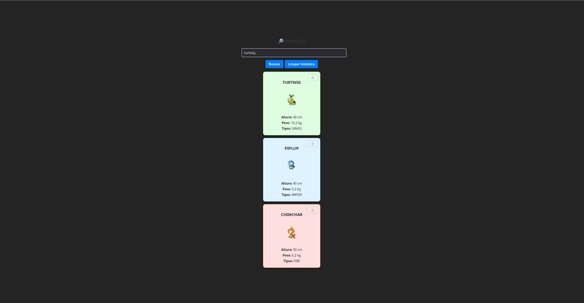

# Pokédex React

A sleek and interactive Pokédex built with **React** and **TypeScript**. Browse, search, view details, and **favorite** your favorite Pokémon using data from the [PokéAPI](https://pokeapi.co/).

---

## 🖼️ Preview

 <!-- Optional: replace with actual image -->

## 🛠️ Tech Stack

- React (Hooks: `useState`, `useEffect`)
- TypeScript for static typing
- Fetch API for external data calls
- Simple CSS Modules for styling

---

## 🚀 Features

- 🗃️ **Paginated list** of Pokémon with “Next” and “Previous”
- 🔎 **Search** by name (case-insensitive)
- 🔧 **Detail view** showing stats, types, abilities
- ⭐ **Favorites**: click the star icon to add/remove favorites  
  • Persistent using `localStorage`  
  • Viewable in a dedicated **Favorites** tab or view  
- ⚠️ Loading and error handling states

---

## ⚙️ Installation & Setup

### Prerequisites

- Node.js v14+  
- npm or yarn

### Steps

```bash
git clone https://github.com/ThiagoMoralesRibeiro/mobileLearn.git
cd mobileLearn/week3/pokedex-react
npm install        # or yarn
npm start          # starts dev server (http://localhost:3000)
npm run build      # prepare production build
```

### Tree Folders
```
pokedex-react/
│
├── public/                  # HTML principal e assets estáticos
├── src/
│   ├── components/          # Componentes React:
│   │     • PokemonCard.tsx  # Cartão de exibição do Pokémon
│   │     • PokemonList.tsx  # Lista paginada
│   │     • SearchBar.tsx    # Campo de busca
│   │     • PokemonDetail.tsx# Tela de detalhes
│   │
│   ├── services/            # Funções fetch para a PokéAPI
│   ├── types/               # Interfaces TypeScript (ex: Pokemon, APIResponse)
│   ├── App.tsx              # Fluxo de navegação e estado global
│   └── index.tsx            # Renderização React
│
└── package.json             # Scripts e dependências
```

